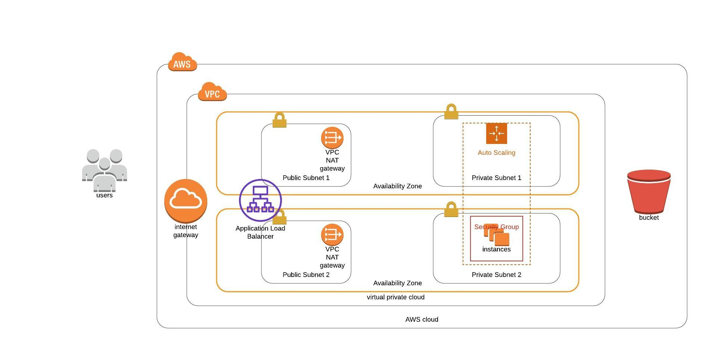

# udacity-clouddevops-project2
Deploy a high-availability web app using CloudFormation

Network Design Diagram


## Commands
### CloudFormation Network Stack creation & Update commands
```sh
$ sh create.sh <cloudformation_network_stack_name> network.yml network-parameters.json
$ sh update.sh <cloudformation_network_stack_name> network.yml network-parameters.json
```
### CloudFormation Server Stack creation & Update commands
```sh
$ sh create.sh <cloudformation_server_stack_name> servers.yml server-parameters.json
$ sh update.sh <cloudformation_server_stack_name> servers.yml server-parameters.json
```
### CloudFormation delete stack command
```sh
$ ws cloudformation delete-stack --stack-name <cloudformation_stack_name>
```
